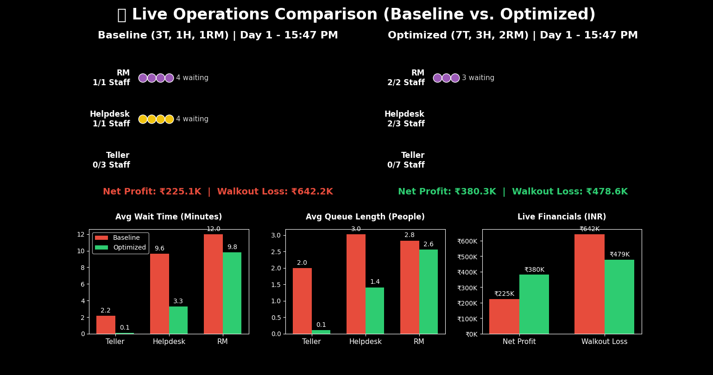

# Simulation-Based Resource Optimization of a Retail Bank Branch 

**Author:** Aditya Kant 

##  Project Overview
This project is a Discrete Event Simulation (DES) designed to optimize the staffing configuration (Tellers, Helpdesk, and Relationship Managers) of a retail bank branch. It acts as a "digital twin," meticulously tracking virtual customers from arrival to departure to optimize business and retail flow. 

Traditional staffing models often rely on steady-state averages that assume constant traffic and infinite customer patience, leading to severe understaffing during peak operational hours. This simulation demonstrates that minimizing daily operational expenses (OpEx) through reduced staffing is strategically flawed, as it incurs substantial opportunity costs via lost revenue from customer walkouts.

##  Methodology & Architecture
The simulation was engineered using Python and the `simpy` framework. It utilizes advanced probability models to mimic a real-world bank environment:

* **The Arrival Process:** Customer arrivals are generated using a Non-Homogeneous Poisson Process (NHPP) via the Thinning Algorithm to simulate realistic traffic waves, factoring in day-of-week and time-of-day multipliers.
* **System Architecture:** Modeled as a multi-server, multi-class queuing network with a Priority Queue Discipline, where 10% of customers are randomly designated as high-priority (VIPs).
* **Service Time Distributions:** * **Tellers (60%):** Modeled with a Gamma distribution (expected time ~3 minutes).
  * **Helpdesk (25%):** Modeled with a Gamma distribution (expected time ~6 minutes).
  * **Relationship Managers (15%):** Modeled with a Lognormal distribution to capture the "long tail" of complex financial consultations.
* **Customer Psychology (Friction):**
  * **Logistic Balking:** Customers evaluate the queue length upon arrival; their probability of joining decays logistically relative to personal tolerance.
  * **Weibull Reneging:** Once in the queue, a customer's patience limit is drawn from a Weibull distribution; if wait times exceed this limit, they abandon the queue.

##  Installation & Setup

1. **Clone the repository:**
   ```bash
   git clone https://github.com/ak160/Bank-Simulation.git
   cd Bank-Simulation
   ```

2. **Install required dependencies:**
   Ensure you have Python installed, then install the necessary libraries:
   ```bash
   pip install simpy numpy pandas matplotlib seaborn scipy
   ```

3. **Run the simulation:**
   ```bash
   python bank_simulation.py


##  Demo & Output Visualizations



